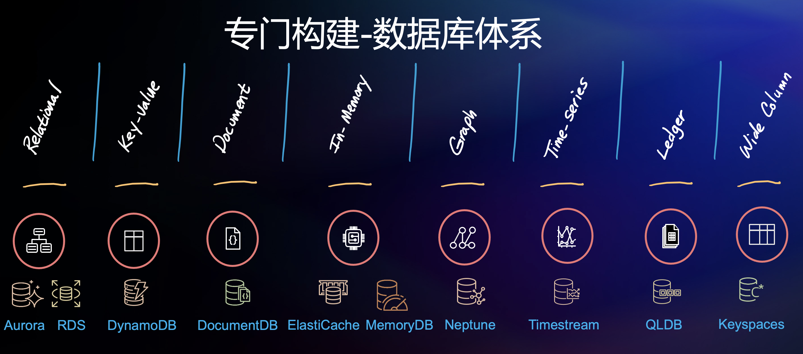
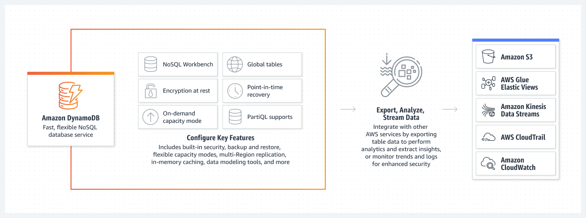
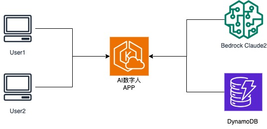
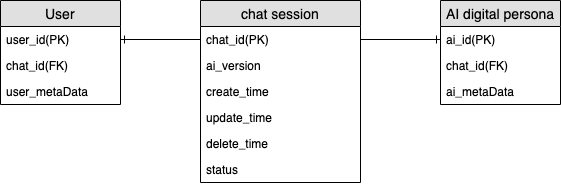
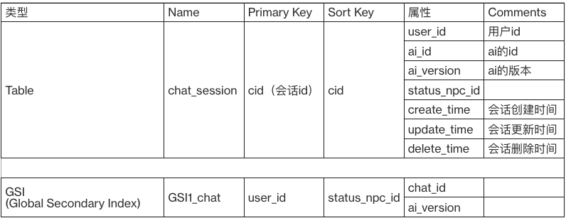
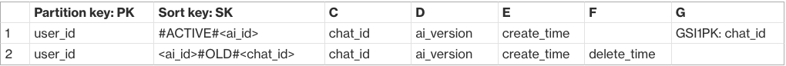
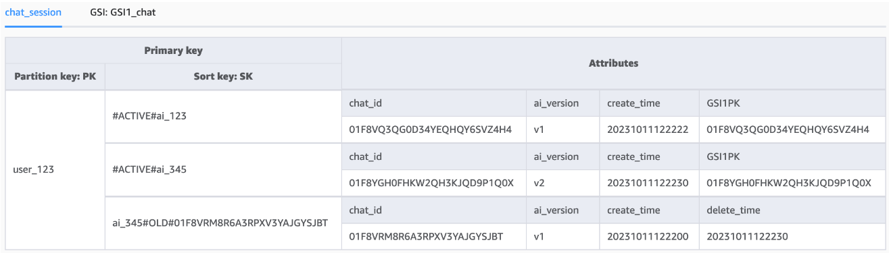
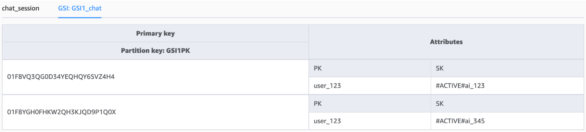
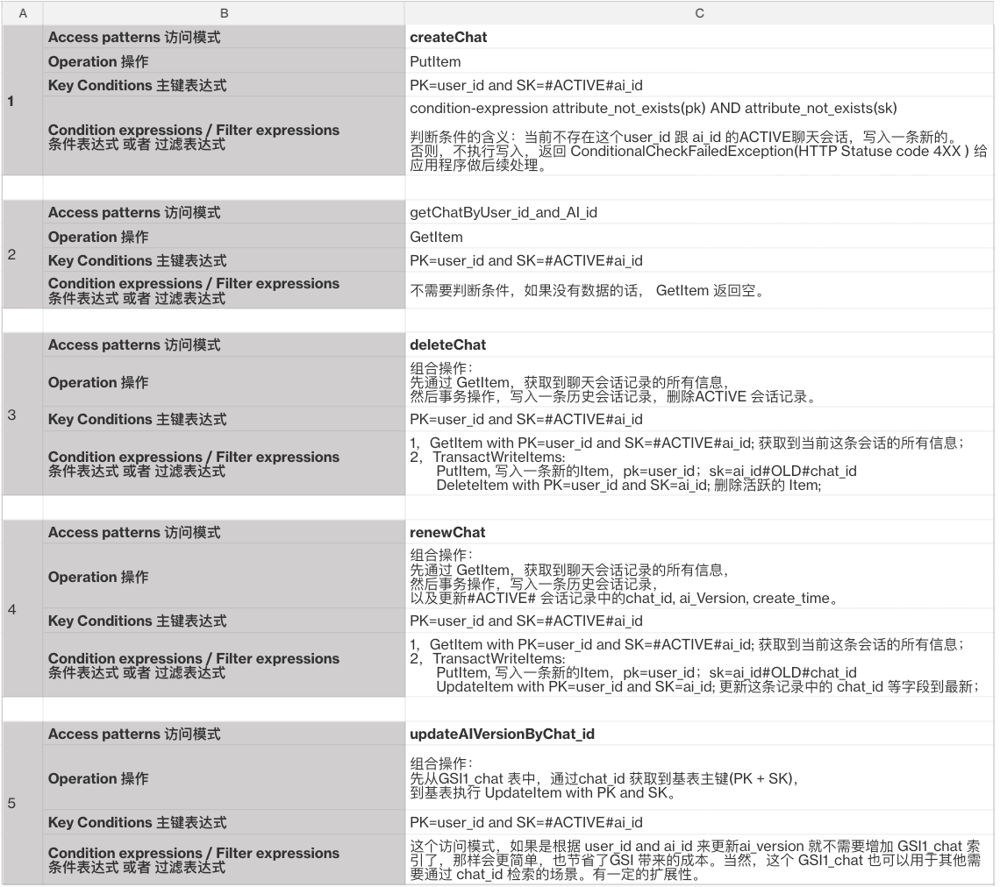

##  DynamoDB设计与建模最佳实践之AI数字人场景


互联网浪潮中，科技改变生活，真切的让我们感受到工作的提效，生活的便利，娱乐多样化。伴随更多的业务需求和极速的系统膨胀，作为核心价值的数据存储方案设计，也变得越发重要，NoSQL(Not only SQL)也逐渐深入人心。亚马逊云科技秉承专门构建的理念，为客户提供完整的云原生数据战略体系，为不同业务类型，提供最优解。



### 1. Why DynamoDB？

自2007年的第一篇 “Dynamo 研究论文”，到2012年Amazon DynamoDB服务的推出。现在，亚马逊云科技在大型非关系数据库和云服务技术领域18年持续投入，带给我们一款为互联网规模的应用程序而生，快速、高度可靠且具有成本效益的 NoSQL 数据库服务。

Amazon DynamoDB 是一种完全托管式、无服务器的 NoSQL 键值数据库，旨在运行任何规模的高性能应用程序。每天持续处理超过 10 万亿个请求。且可提供无限的可扩展性，稳定的个位数毫秒级性能和高达 99.999% 的可用性。


现在我们掌握的 DynamoDB 的能力和使用场景。如何以最佳实践的方式，使用DynamoDB是很多客户关心的话题。下面就以一个真实的AI数字人的业务场景，开启DynamoDB 数据建模和设计之旅。


### 2. 业务场景描述

AIGC（AI-Generated Content，人工智能生成内容）风靡全球，而LLM（Large Language Model）创造力和智慧是最惊艳的部分。但是在工程化的过程中，我们希望数字人可以有“记忆”，来延续对话的上下文。那么会话的记忆存储，就需要一个可以承载高并发，低延迟数据库来支撑业务。


#### 2.1. 架构图详解

根据业务需求，将大语言模型 Bedrock Claude2和Amazon DynamoDB结合，来实现智能“问答”和“记忆”。
问答流程：

1. user发起访问
2. 基于Amazon Elastic Kubernetes Service（Amazon EKS）运行的AI数字人应用，接收对话请求
3. APP查询DynamoDB会话的历史记录，并结合当前会话内容，整合信息
4. 发送整合后信息到Bedrock Claude2，获取“回答”
5. APP发送“回答”给user




### 3. 数据查询/存储方案

在理清业务需求和技术实现架构之后，我们需要针对会话历史信息的存储和查询，进行详尽的技术拆解。


#### 3.1. 表设计和实体关系详解

- 聊天会话表用于记录用户和AI数字人之间的聊天ID(chat_id)。
- 应用程序会根据用户ID(user_id)和AI数字人(ai_id)，获取当前#ACTIVE# 的chat_id。
- 用户可以选择删除旧的chat_id(软删除，在数据库要保留这条记录，通过delete_time 时间戳等信息来表示历史聊天)。
- 用户也可以重启聊天会话，同时删除旧的聊天会话，创建一个新的聊天会话。
- 因此，一个用户跟AI数字人之间允许有多条聊天会话记录，但是同一时间有且仅有一条处于活跃状态#ACTIVE#的聊天会话记录。

##### 3.1.1. ERD（数据库实体关系图）：


涉及的实体包括: 用户(user_id)，AI数字人(ai_id)，聊天会话( chat_id)
用户跟AI数字人之间是多对多的关系：

* 用户可以跟多个AI数字人存在多条聊天会话记录；
* AI数字人也可以跟多个用户存在多条聊天会话记录；

##### 3.1.2. 访问模式（聊天会话的增删改查）：

- 创建新的聊天会话 - createChat
- 获取指定聊天会话 - getChatByUser_id_and_ai_id
- 删除聊天会话 - deleteChat
- 重启聊天会话 - renewChat
- 更新指定会话ai_version - updateAIVersionByChat_id

### 4. DynamoDB 数据建模&表格设计：

#### 4.1. 表格设计

我们需要一个基表存储数据，同时需要一个GSI(Global Secondary Index)辅助查询。

- 基表名称: chat_session 
- 全局二级索引名称: GSI1_chat（选择 Keys_Only 模式）

表格定义：

 


#### 4.2. 表格设计技巧
DynamoDB是一个全托管，且简单易用的数据库。但是如何发挥其性能优势，也是需要我们知其善用。
这里我们就罗列一些小技巧

- 有效利用 DynamoDB 排序键的特性：
    例如标记活跃状态的 SK前缀是 #ACTIVE#，以# 字符开头，让这条记录在排序过程中保持置顶。
- 兼顾业务和技术的Key设计：
场景1. chat_id ，我们可以使用ULID （一种全局唯一且可以按字典序排序的标识符格式），其比随机UUID 增加了时间戳，查询性能会更好。
场景2. 在以user_id & ai_id 作为查询条件，且以时间维度排序所有历史聊天会话的场景，ULID 就可以提供更好的查询性能。


 

#### 4.3. 表数据样例
- 基表插入数据后的样式
 
- GSI的数据样式
 


### 5. 访问模式实现：
在完成表格设计之后，如何消费数据，以满足业务需求？ 后续内容会详细介绍。

#### 5.1. 创建新的聊天会话 - createChat

在基表 chat_session 上执行 putItem 操作，通过条件判断表达式(ConditionExpression)，确定当前表中不存在这条记录，才执行写入新的聊天会话。如果条件判断检查失败，则返回应用端 ConditionalCheckFailedException，表示数据库中存在这条记录。需要应用端做业务逻辑判断再操作。

```
put_item_params = {
    'TableName': 'chat_session',
    'Item': {
        'PK': {'S': user_id},
        'SK': {'S': '#ACTIVE#' + ai_id},
        'chat_id': {'S': chat_id},
        'create_time': {'S': create_timestamp},
        'GSI1PK': {'S': chat_id}
    },
    'ConditionExpression': 'attribute_not_exists(PK) AND attribute_not_exists(SK)'
}
```

#### 5.2. 获取指定聊天会话 - getChatByUser_id_and_ai_id

在基表 chat_session 上执行 getItem 操作，指定 PK=user_id and SK=#ACTIVE#ai_id，获取返回结果。

#### 5.3. 标记删除聊天会话 - deleteChat

组合操作完成这个场景，首先getItem 获取到当前活跃聊天会话记录的所有属性。然后事务写入，插入一条有delete_time 的历史会话记录，并删除当前活跃聊天会话记录。相关步骤参数见下面：

第一步：getItem PK=user_id  and SK=#ACTIVE#ai_id， 可以复用上面的 getChatByUser_id_and_ai_id 函数。获取到这条Item所有信息记录下来。
第二步：事务写入
putItem PK=user_id and SK=ai_id#OLD#chat_id, 其他属性包括 chat_id, ai_version, create_time, delete_time. 
deleteItem PK=user_id  and SK=#ACTIVE#ai_id。

#### 5.4. 重新启动聊天会话 - renewChat

组合操作完成这个场景，跟上面软删除很类似，只是在事务写入时候，使用 updateItem。首先getItem 获取到当前活跃聊天会话记录的所有属性。然后事务写入，插入一条有delete_time 的历史会话记录，然后更新当前活跃聊天会话记录，为最新的 ai_version，chat_id。相关步骤参数见下面：

第一步：getItem PK=user_id  and SK=#ACTIVE#ai_id， 可复用 getChatByUser_id_and_ai_id 函数。获取到这条Item所有信息记录下来。
第二步：事务写入
putItem PK=user_id and SK=ai_id#OLD#chat_id, 其他属性包括 chat_id, ai_version, create_time, delete_time. 
updateItem PK=user_id  and SK=#ACTIVE#ai_id，其他属性包括 chat_id, ai_version, create_time, GSI1PK.


#### 5.5. 更新指定会话ai version - updateAIVersionByChat_id

第一步：GSI1_chat 中 getItem PK=chat_id; 拿到基表的PK, SK
第二步：基表 chat_session 中 updateItem，PK=user_id, SK=#ACTIVE#ai_id


#### 5.6. 访问模式和实现方法汇总：

为便于理解，我们将前面的访问模式，结合具体的实现方法，通过表格的形式进行汇总。


 


### 总结

通过以上内容，我们希望你理解“专门构建”的含义。不再是根据数据库设计业务，而是通过业务选择适合的数据库。在类似场景下，DynamoDB作为Key-Value数据库，可以充分发挥高并发，低延迟，高稳定性的特点。支撑核心业务的稳定运行。
也希望通过本文，带来更清晰的DynamoDB的建模方法，建表模式，以及高性能查询的最佳实践。


#### 参考文档链接


1.  [Amazon DynamoDB](https://docs.aws.amazon.com/zh_cn/amazondynamodb/latest/developerguide/GettingStartedDynamoDB.html)
2.  [Gaming profile schema design in DynamoDB](https://docs.aws.amazon.com/zh_cn/amazondynamodb/latest/developerguide/data-modeling-schema-gaming-profile.html)
 

#### 本文作者：

许晓亮 亚马逊云科技解决方案架构师


李君 亚马逊云科技


